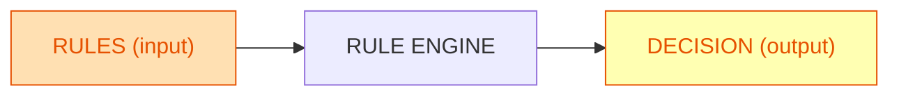
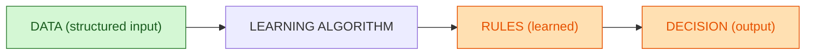
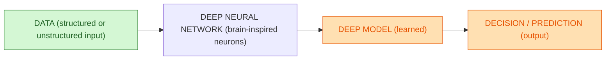

# 1. **Intelligence Artificielle (IA)**  
C’est le cadre général : tout système informatique qui imite un comportement intelligent grâce à des **règles écrites par des humains**.  
C’est du **“si… alors…”**, du raisonnement basé sur des règles prédéfinies.  

**Exemples :**  
– Un distributeur automatique qui donne du café ou du thé quand on appuie sur B1 ou B2  
– Une laveuse-sécheuse où tu choisis le programme en appuyant sur un bouton  
– Une calculatrice qui applique des opérations selon les touches  

Dans tous ces cas, **aucun apprentissage**, juste des règles programmées.

## IA par règles (input = rules, output = decision)

**Lecture** :
Règles programmées en entrée → moteur applique les règles → décision en sortie (aucun apprentissage).

# 2. **Machine Learning (ML)**  
C’est un sous-ensemble de l’IA : la machine **apprend des règles automatiquement à partir de données structurées et propres** pour résoudre une tâche pas trop complexe.  
On ne code plus “si… alors…”, on donne des **exemples (données)** et l’algorithme **trouve les patterns**.  

**Exemples :**  
– Prédire le prix d’un logement en fonction de surface et localisation  
– Classer des emails en “spam” ou “non spam”  
– Ajuster automatiquement des prix selon l’historique des ventes  

## Machine Learning (input = data, output = learned rules + decision)

**Lecture** :
Données structurées en entrée → algorithme apprend des règles (modèle) → règles appliquées pour produire une décision.

# 3. **Deep Learning (DL)**  
C’est un sous-ensemble du Machine Learning, **inspiré du fonctionnement du cerveau humain**, utilisant des **réseaux de neurones à plusieurs couches**.  
Il est fait pour des **tâches très complexes** ou des **données massives et souvent non structurées** (images, sons, texte libre).  

**Exemples :**  
– Reconnaissance d’objets dans des images  
– Reconnaissance vocale à grande échelle  
– Générer un avatar virtuel qui parle et imite ta voix à partir de milliers d’échantillons

## Deep Learning (input = structured or unstructured data, output = deep model + decision)

**Lecture** :
Données **structurées ou non structurées** en entrée + **tâche complexe** → **réseau profond de neurones inspiré du cerveau humain** → **modèle appris** → **décision/prédiction**.

### Résumé visuel

* **IA par règles** : Règles en entrée → Décision en sortie (pas d’apprentissage).
* **Machine Learning** : Données structurées en entrée → Règles apprises (modèle) → Décision.
* **Deep Learning** : Données structurées ou non + tâches complexes en entrée → Réseau profond de neurones (imitation cerveau humain) → Modèle appris → Décision.

