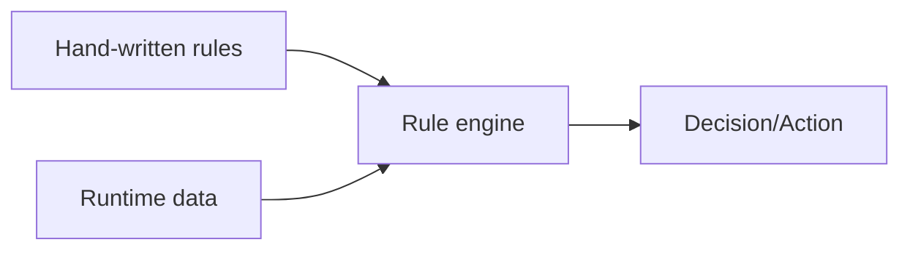
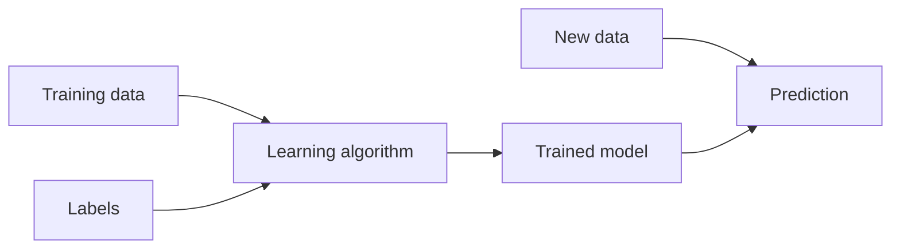
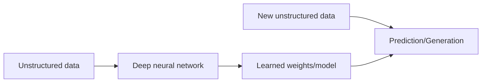

Voici ce que tu peux mettre dans ton fichier (quiz et définitions) avec la logique **simple “input → output”** que tu veux :

---

# Quiz – IA / ML / DL

**1.** Un logiciel d’échecs qui choisit le meilleur coup grâce à des règles et un moteur de recherche d’états, sans apprentissage.
→ IA, ML ou DL ?

**2.** Un programme qui apprend à prédire la consommation d’eau d’une ville à partir des données des années précédentes (régression).
→ IA, ML ou DL ?

**3.** Une application qui identifie automatiquement des objets dans des images grâce à un réseau de neurones convolutionnel (CNN) qui est une tâche très complexe.
→ IA, ML ou DL ?

**4.** Un assistant vocal très simple qui suit des scripts prédéfinis pour répondre aux commandes (« ouvre la lampe », « joue de la musique ») sans apprentissage (des règles).
→ IA, ML ou DL ?

**5.** Un modèle de traitement du langage qui traduit automatiquement des phrases en utilisant un transformeur entraîné sur des millions d’exemples qui est une tâche très complexe.
→ IA, ML ou DL ?

**6.** Un distributeur automatique qui donne du café ou du thé en appuyant sur B1, B2… (aucun apprentissage, juste des boutons).
→ IA, ML ou DL ?

**7.** Un logiciel d’échecs qui choisit le meilleur coup grâce à des règles et une base de connaissances, sans apprentissage.
→ IA, ML ou DL ?

**8.** Un programme qui apprend à ajuster les prix d’un produit en fonction des ventes passées et du comportement des clients (beaucoup de données pour produire des règles).
→ IA, ML ou DL ?

**9.** Un service qui génère un avatar virtuel qui parle à votre place, en imitant votre voix et vos expressions à partir de milliers d’exemples audio et vidéo.
→ IA, ML ou DL ?

**10.** Un modèle qui apprend à comprendre et classer des messages écrits non structurés (par exemple des avis clients en texte libre) pour en extraire un sentiment (positif/négatif).
→ IA, ML ou DL ?

---

# Définitions simplifiées (avec logique entrée/sortie)

**Intelligence Artificielle (IA)**
– **Entrée** : règles écrites par le développeur + données d’exécution
– **Sortie** : décision ou action déterminée par les règles
– C’est du « si… alors… », pas d’apprentissage
– Exemples : distributeur automatique (B1/B2), laveuse-sécheuse (sélection programme), calculatrice

**Machine Learning (ML)**
– **Entrée** : données structurées et propres + labels
– **Sortie** : modèle (règles apprises automatiquement)
– Tâches pas trop complexes
– Exemples : prédire un prix, classer spam/non spam, ajuster des prix selon l’historique

**Deep Learning (DL)**
– **Entrée** : données massives et souvent non structurées (images, audio, texte)
– **Sortie** : réseau de neurones profond (poids appris) capable de traiter des tâches complexes
– Exemples : reconnaissance d’objets dans des images, reconnaissance vocale à grande échelle, génération d’un avatar parlant qui imite ta voix

---

## Diagrammes Mermaid

### IA par règles (programmation)

### Machine Learning (apprendre règles à partir des données)

### Deep Learning (réseaux de neurones, données non structurées)

Ces blocs **se rendent correctement sur GitHub** (pas d’accents, parenthèses ou guillemets typographiques).
Tu peux coller exactement ça dans ton README.md et avoir ton quiz + définitions + schémas.
