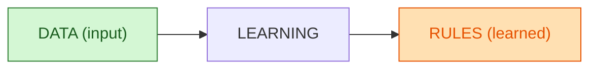
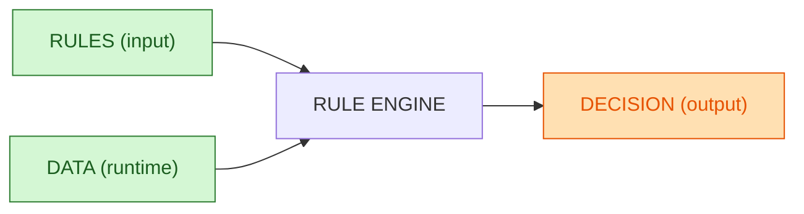

D’accord 🙂
Voici les **diagrammes Mermaid ultra-simples** qui montrent **input** et **output** avec les **mêmes couleurs pour “rules” et “data”**, prêts à coller sur GitHub.

---

### Machine Learning (input = data, output = learned rules)

**Lecture** : on donne des **données en entrée**, l’algorithme apprend, et on obtient des **règles/modèle en sortie**.

---

### IA par règles (input = rules, output = decision)

**Lecture** : on donne des **règles et des données en entrée**, le moteur applique ces règles et donne une **décision/action en sortie**.

---

Ces deux blocs **se rendent correctement sur GitHub** :
– Pas d’accents ni guillemets typographiques
– Parenthèses limitées
– Couleurs définies via `classDef`

Tu peux ainsi montrer clairement la différence :

* **ML** : Data en entrée → Règles (modèle) en sortie
* **IA règles** : Règles en entrée → Décision en sortie
