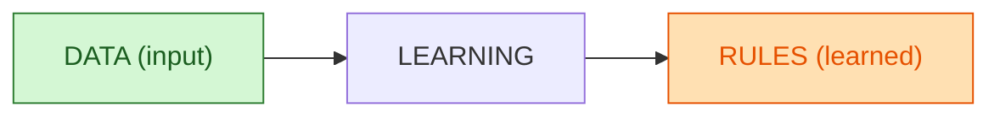
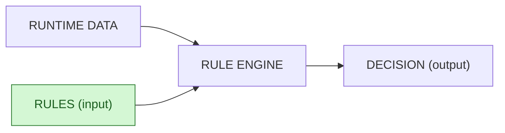

Voici des **diagrammes Mermaid ultra-simples** qui montrent exactement ce que tu veux, avec **couleurs** sur l’**entrée data** (vert) et la **sortie rules** (orange). Compatibles GitHub (ASCII, labels courts, pas d’accents).

---

## Machine Learning — input = data, output = rules (learned)

### Variante compacte (de secours)

---

## IA par règles — input = rules, output = decision (pour contraste)

Tu peux copier-coller tel quel dans ton README.md. Si GitHub chipote, utilise la **variante compacte**.
