Parfait 🙂
Voici la version réécrite, en incluant explicitement que le **Deep Learning** peut utiliser des données structurées ou non structurées, que la **tâche est complexe** et qu’il est **inspiré des neurones du cerveau humain**.
Tout est prêt pour GitHub.

---

## IA par règles (input = rules, output = decision)

```mermaid
flowchart LR
  %% IA par règles : règles codées par l'humain -> moteur -> décision
  RULES["RULES (input)"] --> ENGINE["RULE ENGINE"] --> DEC["DECISION (output)"];

  classDef input fill:#ffe0b2,stroke:#e65100,stroke-width:1px,color:#e65100; 
  classDef output fill:#ffffb2,stroke:#e65100,stroke-width:1px,color:#e65100; 

  class RULES input;
  class DEC output;
```

**Lecture** :
Règles programmées en entrée → moteur applique les règles → décision en sortie (aucun apprentissage).

---

## Machine Learning (input = data, output = learned rules + decision)

```mermaid
flowchart LR
  %% ML : données structurées -> algo -> règles apprises -> décision
  DATA["DATA (structured input)"] --> ALGO["LEARNING ALGORITHM"] --> RULES["RULES (learned)"];
  RULES --> DEC["DECISION (output)"];

  classDef input fill:#d4f7d4,stroke:#2e7d32,stroke-width:1px,color:#1b5e20; 
  classDef output fill:#ffe0b2,stroke:#e65100,stroke-width:1px,color:#e65100; 

  class DATA input;
  class RULES output;
  class DEC output;
```

**Lecture** :
Données structurées en entrée → algorithme apprend des règles (modèle) → règles appliquées pour produire une décision.

---

## Deep Learning (input = structured or unstructured data, output = deep model + decision)

```mermaid
flowchart LR
  %% DL : données structurées ou non + tâche complexe -> réseau profond de neurones inspiré du cerveau humain -> modèle appris -> décision
  DATAU["DATA (structured or unstructured input)"] --> NET["DEEP NEURAL NETWORK (brain-inspired neurons)"] --> MODEL["DEEP MODEL (learned)"];
  MODEL --> DEC["DECISION / PREDICTION (output)"];

  classDef input fill:#d4f7d4,stroke:#2e7d32,stroke-width:1px,color:#1b5e20; 
  classDef output fill:#ffe0b2,stroke:#e65100,stroke-width:1px,color:#e65100; 

  class DATAU input;
  class MODEL output;
  class DEC output;
```

**Lecture** :
Données **structurées ou non structurées** en entrée + **tâche complexe** → **réseau profond de neurones inspiré du cerveau humain** → **modèle appris** → **décision/prédiction**.

---

### Résumé visuel

* **IA par règles** : Règles en entrée → Décision en sortie (pas d’apprentissage).
* **Machine Learning** : Données structurées en entrée → Règles apprises (modèle) → Décision.
* **Deep Learning** : Données structurées ou non + tâches complexes en entrée → Réseau profond de neurones (imitation cerveau humain) → Modèle appris → Décision.

Ces blocs Mermaid sont prêts à coller dans ton README.md.
