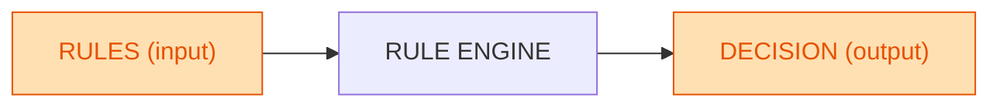

# IA par règles (input = rules, output = decision)

# Machine Learning (input = data, output = learned rules)

**Lecture** : on donne des **données en entrée**, l’algorithme apprend, et on obtient des **règles/modèle en sortie**.

---

**Lecture** : on donne des **règles et des données en entrée**, le moteur applique ces règles et donne une **décision/action en sortie**.

---

Ces deux blocs **se rendent correctement sur GitHub** :
– Pas d’accents ni guillemets typographiques
– Parenthèses limitées
– Couleurs définies via `classDef`

Tu peux ainsi montrer clairement la différence :

* **ML** : Data en entrée → Règles (modèle) en sortie
* **IA règles** : Règles en entrée → Décision en sortie

Parfait, voici le diagramme **IA par règles** simplifié au maximum avec **juste RULES en input** (colorié) et **DECISION en output** (colorié). Compatible GitHub :

**Lecture** :
– Tu donnes **des règles en entrée**,
– Le moteur applique ces règles,
– Tu obtiens une **décision/action en sortie**.
