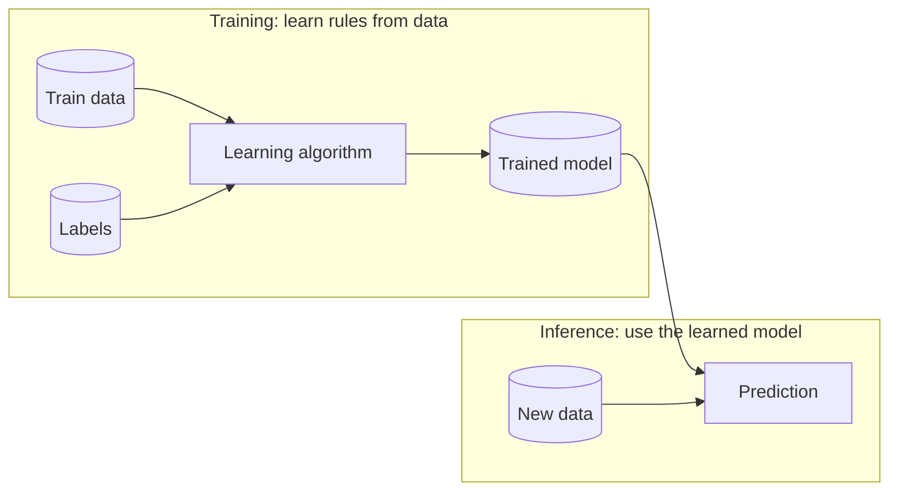
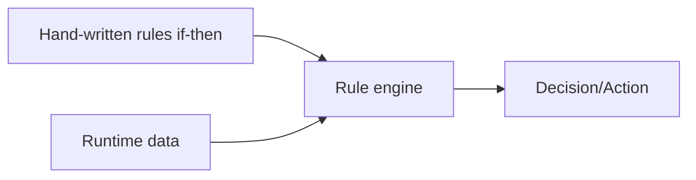
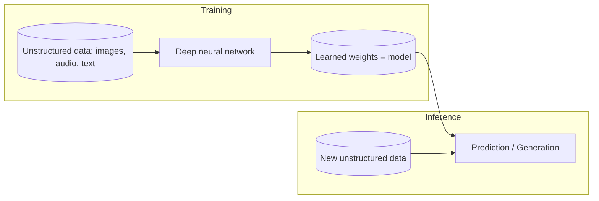
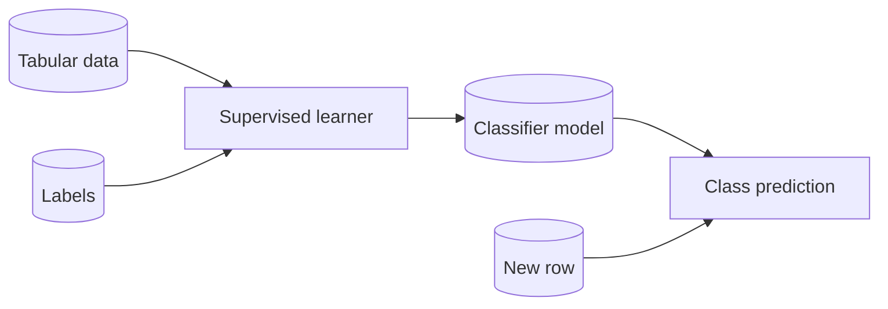
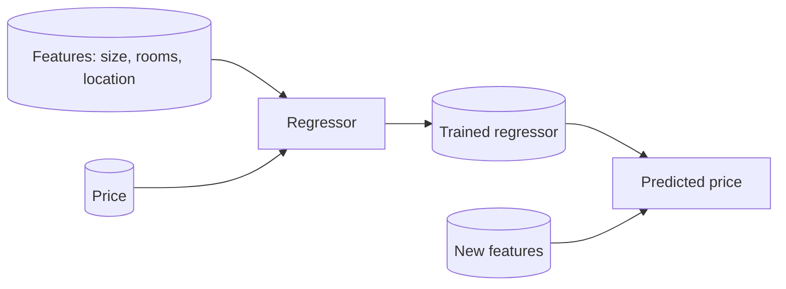
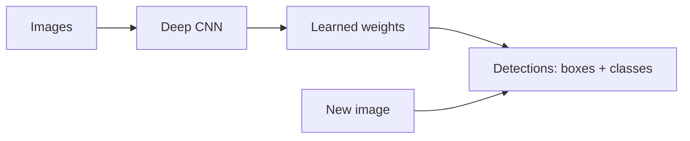
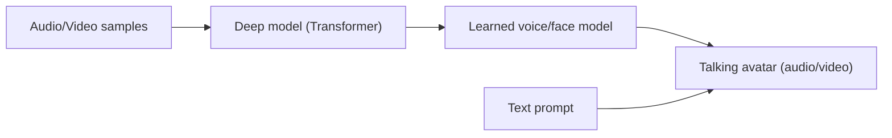
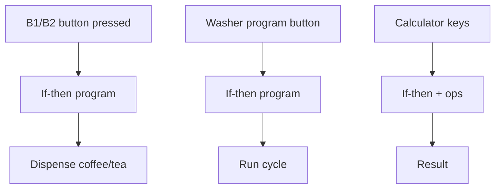
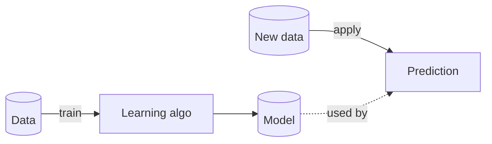

Top — GitHub n’aime pas certains caractères (accents, guillemets échappés, parenthèses longues) dans les **titres de subgraph** et **labels** Mermaid.
Voici des **versions 100% compatibles GitHub** (ASCII, labels simples), plus **plein d’exemples** à coller et tester.

---

## 1) Machine Learning — learn rules from data (train + inference)



**Lecture rapide**

* Entrée (training) : data + labels → Sortie : **model** (règles apprises)
* Entrée (inference) : new data + model → Sortie : **prediction**

---

## 2) Rules-based AI — programming (if-then)



**Lecture rapide**

* Entrée : **règles écrites** + données d’exécution → Sortie : **décision**
* Pas d’apprentissage automatique.

---

## 3) Deep Learning — unstructured data, deep nets



**Lecture rapide**

* Entrée (train) : données **non structurées** → Sortie : **poids/ modèle**
* Entrée (infer) : nouvelles données + modèle → **prédiction / génération**

---

# Beaucoup d’exemples à tester

### A) ML (supervised) — classifier simple



### B) ML (regression) — price prediction



### C) DL (vision) — object detection with CNN



### D) DL (speech/avatar) — text & voice



### E) Rules-based — vending machine / washer / calculator



### F) Decision guide — which approach?

```mermaid
flowchart TB
  Q0{Need learning from data?}
  Q0 -- No --> RB[Rules-based: write if-then rules]
  Q0 -- Yes --> Q1{Data type mostly structured?}
  Q1 -- Yes --> ML[Use ML (trees, SVM, regression)]
  Q1 -- No --> Q2{Images/Audio/Text or high complexity?}
  Q2 -- Yes --> DL[Use DL (CNN/RNN/Transformer)]
  Q2 -- No --> ML2[ML + feature engineering]
```

### G) Compact — ML in one glance



---

## Conseils GitHub Mermaid

* Évite les **accents**, **guillemets**, **parenthèses longues** dans les **titres de subgraph** et **labels**.
* Utilise des labels courts en **ASCII**.
* Garde la structure `flowchart LR|TB`, `subgraph ID[Title] ... end`.
* Si un rendu échoue, **simplifie** d’abord les labels (pas de slash, pas de guillemets).

Tu veux une variante **ultra-minimale** uniquement avec “Input/Output” pour coller en tête de chapitre ?
